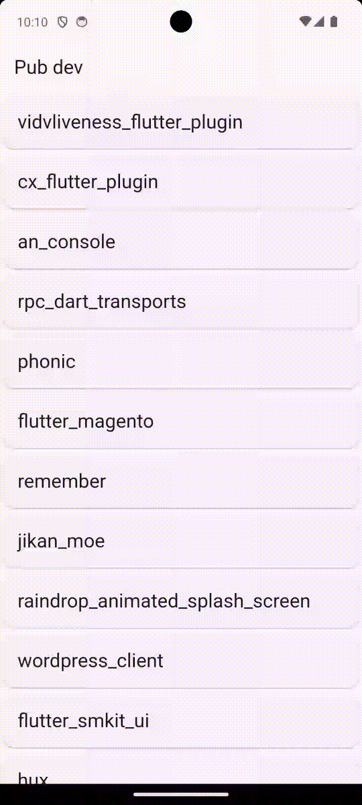
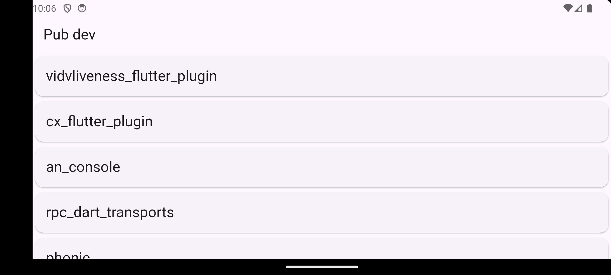
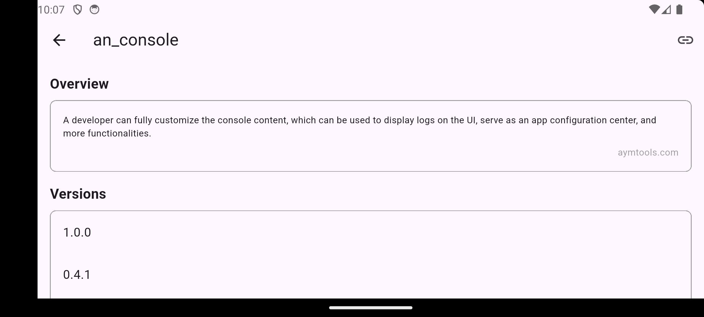
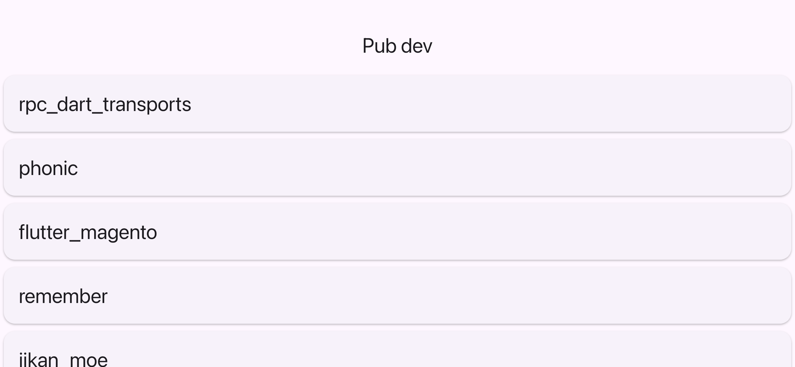
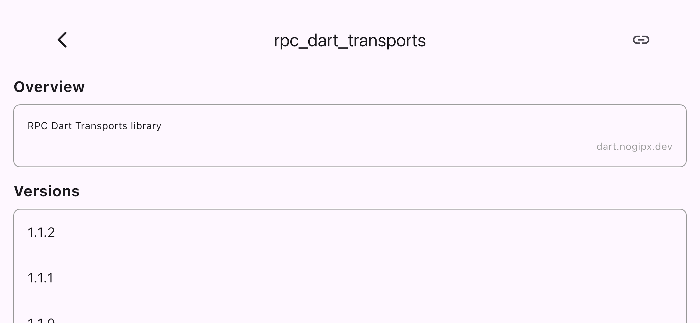

# pub_dev_api_app

## 概要

pub.dev APIを使用してFlutterパッケージの情報を取得・表示するFlutterアプリケーションです。
クリーンアーキテクチャを採用し、Riverpodを用いた状態管理とDioを使ったHTTP通信を実装しています。

### 主な機能

- パッケージ一覧の表示
- パッケージ詳細情報の閲覧
- pub.devへのリンク機能

## 環境構築・バージョン要件

### 開発環境

- **Flutter SDK**: 3.9.0以上
- **Dart SDK**: 3.9.0以上

### バージョン情報

- **アプリバージョン**: 1.0.0+1

### セットアップ手順

1. リポジトリをクローン

```bash
git clone <repository-url>
cd pub_dev_api_app
```

1. 依存関係をインストール

```bash
flutter pub get
```

1. コード生成を実行

```bash
dart run build_runner build
```

1. アプリを起動

```bash
flutter run
```

## 利用プラグイン

### 主要依存関係

- **dio** (^5.9.0): HTTP通信ライブラリ
- **hooks_riverpod** (^3.0.0): 状態管理ライブラリ
- **riverpod_annotation** (^3.0.0): Riverpodアノテーション
- **json_annotation** (^4.9.0): JSONシリアライゼーション用アノテーション
- **url_launcher** (^6.3.2): 外部URLを開くためのプラグイン
- **cupertino_icons** (^1.0.8): iOSスタイルのアイコン

### 開発用依存関係

- **build_runner** (^2.7.1): コード生成ツール
- **json_serializable** (^6.11.1): JSONシリアライゼーション
- **riverpod_generator** (^3.0.0): Riverpodコード生成
- **flutter_lints** (^5.0.0): Dart/Flutterのリンティングルール

## デモ動画・画面キャプチャ

### アプリケーションの動作

| プラットフォーム | デモ動画 |
|:---:|:---:|
| **Android** |  |
| **iOS** |  |

### 画面キャプチャ（横向き表示）

| プラットフォーム | パッケージ一覧画面 | パッケージ詳細画面 |
|:---:|:---:|:---:|
| **Android** |  |  |
| **iOS** |  |  |

## アーキテクチャ

本アプリケーションはクリーンアーキテクチャをベースとした層構造を採用し、関心事の分離と依存関係の整理を行っています。
状態管理にはRiverpodを使用し、Providerパターンによるデータの流れを実現しています。

```text
lib/
├── domain/           # ビジネスロジック層
│   ├── entities/     # エンティティ
│   ├── repositories/ # リポジトリインターフェース
│   └── usecases/     # ユースケース
├── infrastructure/   # データ層
│   ├── api/          # API通信
│   ├── dto/          # データ転送オブジェクト
│   └── repositories/ # リポジトリ実装
└── presentation/     # プレゼンテーション層
    ├── controllers/  # コントローラー
    ├── pages/        # 画面
    └── providers/    # Riverpodプロバイダー
```

### 技術的特徴

- **クリーンアーキテクチャベース**: 層間の依存関係を明確にし、テスタビリティと保守性を向上
- **Riverpod**: 状態管理とDIコンテナの役割を担い、リアクティブなデータフローを実現
- **Provider Pattern**: UIと状態の分離により、宣言的なUI構築をサポート
